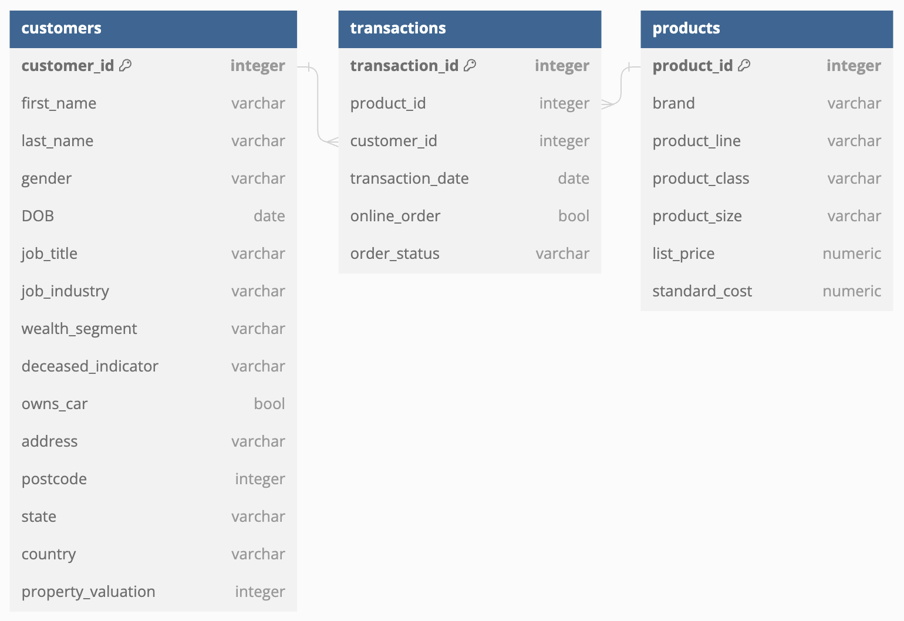
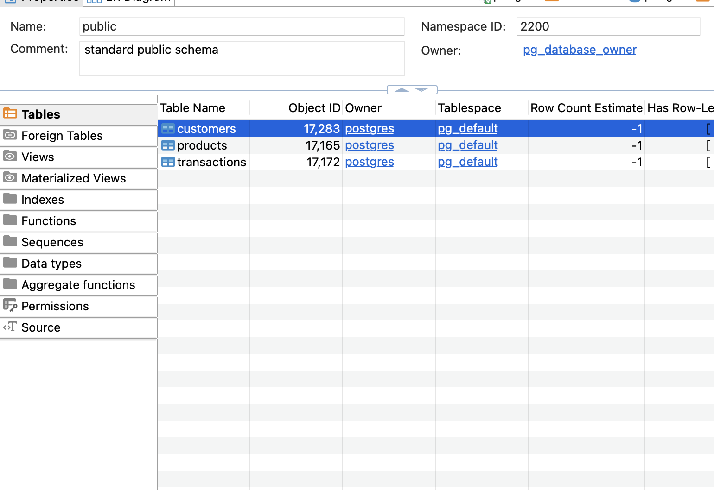
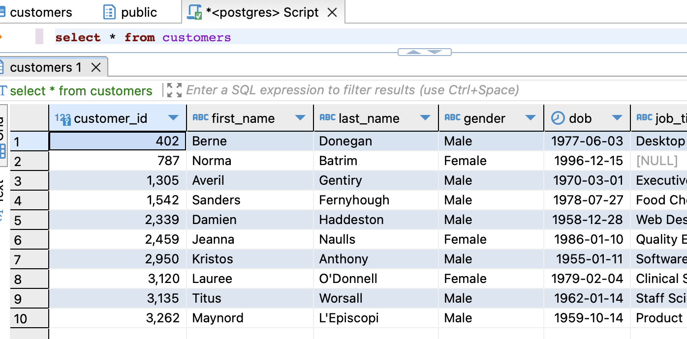
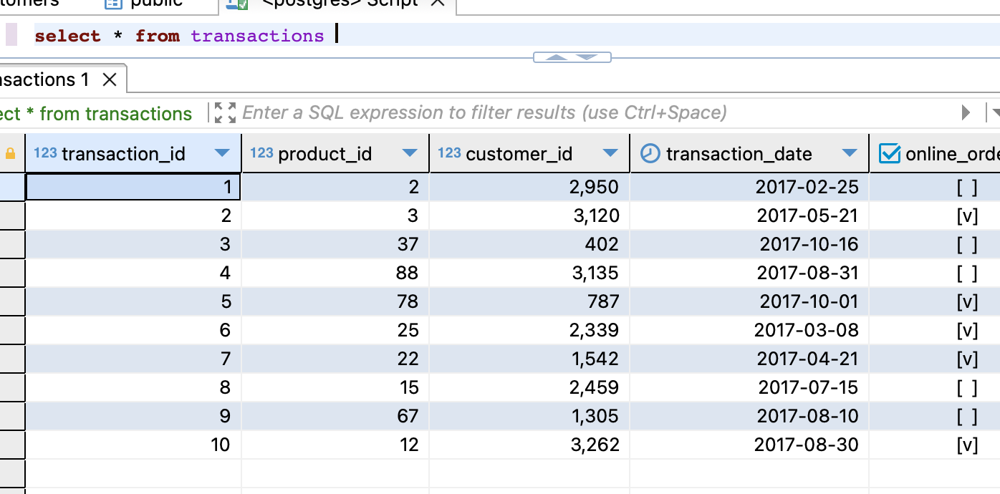
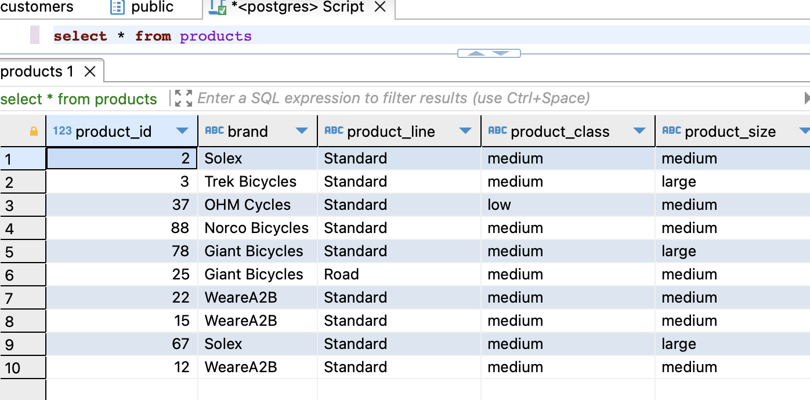

# Задание 1

## 1. Структура базы данных, 2. Нормализация

Таблицу, представленную в задании можно разделить на несколько сущностей: transactions, products, customers, таким образом база данных будет находиться во второй нормальной форме (все атрибуты полностью зависят от ключа). Более того, транзитивных связей в таблице присутствовать не будет, а следовательно, БД находится в третьей нормальной форме.
Структура базы данных представлена на следующей картинке, или в папке screenshots в данном репозитории.

## 3. Создание таблиц в DBEAVER

Для создания таблиц в DBEAVER был написан скрипт, использующий команду CREATE TABLE, представленный в файле db_script.sql. Результат работы представлен на следующей картинке, или в папке screenshots в данном репозитории.

## 4. Добавление данных в таблицы
Для создания таблиц в DBEAVER был написан скрипт, использующий команду INSERT INTO, представленный в файле db_script.sql. Результат работы представлен на следующей картинке, или в папке screenshots в данном репозитории.

